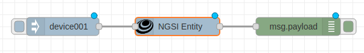
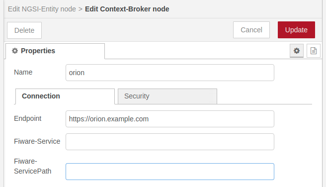
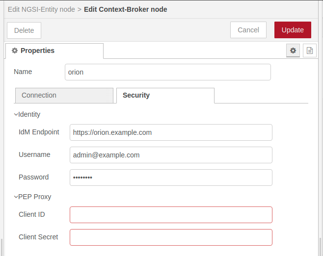

# Node-RED

## Create entity

```
ngsi create --host orion.example.com entity --data '{"id":"device001"}' --keyValues
```

```
ngsi get --host orion.example.com entity --id device001 --pretty
{
  "id": "device001",
  "type": "Thing"
}
```

## Create flow



```
[{"id":"22c1abd2f3953dc4","type":"tab","label":"flow1","disabled":false,"info":""},{"id":"ca443434c8b99c5a","type":"inject","z":"22c1abd2f3953dc4","name":"","props":[{"p":"payload"}],"repeat":"","crontab":"","once":false,"onceDelay":0.1,"topic":"","payload":"device001","payloadType":"str","x":300,"y":180,"wires":[["354b5c13a6eda39a"]]},{"id":"43be416d8e939507","type":"debug","z":"22c1abd2f3953dc4","name":"","active":true,"tosidebar":true,"console":false,"tostatus":false,"complete":"false","statusVal":"","statusType":"auto","x":690,"y":180,"wires":[]},{"id":"354b5c13a6eda39a","type":"NGSI-Entity","z":"22c1abd2f3953dc4","name":"","endpoint":"802c3058092a74ab","protocol":"v2","ldContext":"https://uri.etsi.org/ngsi-ld/v1/ngsi-ld-core-context.jsonld","mode":"normalized","mimeType":"application/ld+json","attrs":"","x":490,"y":180,"wires":[["43be416d8e939507"]]},{"id":"802c3058092a74ab","type":"Context-Broker","name":"orion","endpoint":"https://orion.example.com","service":"","servicepath":"","idmEndpoint":"https://orion.example.com"}]
```

## Configration for Context-Broker node

### Connection

-   Endpoint: `https://orion.example.com`



### Security

-   IdM Endpoint: `https://orion.example.com`
-   Username: `admin@example.com`
-   Password: `Your password`



## Inject payload


